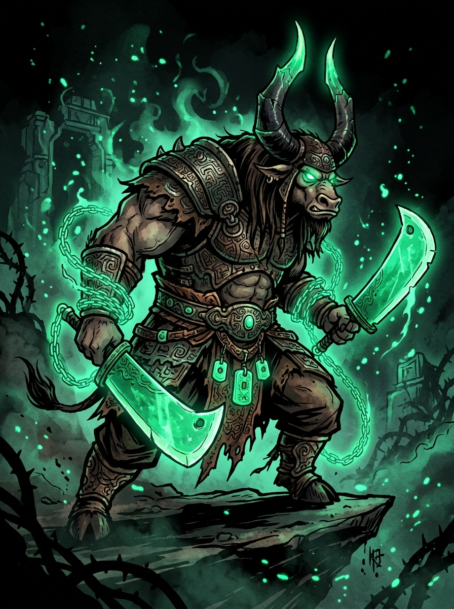
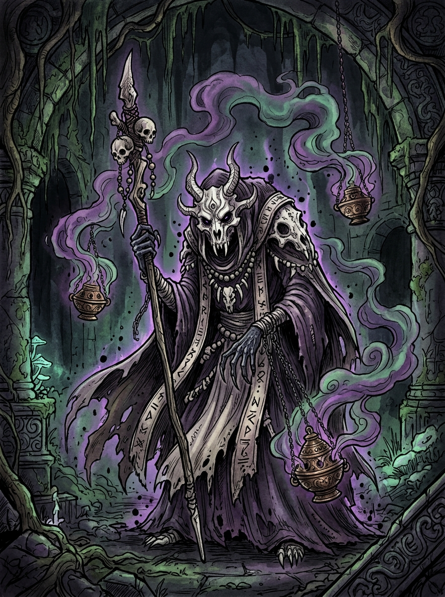

# Castlevania: General Kai (The Jade Dominion) 🐃⚔️💚

Um jogo 2D no estilo **Metroidvania** (*Hollow Knight* + *Castlevania*), onde o protagonista é o **General Kai** (de *Kung Fu Panda*), com todas as suas habilidades canônicas de Lâminas de Jade em correntes, absorção de Chi e invocação de Amuletos (*Jombies*).

---

## 🎮 Protótipo Jogável
Você pode abrir e jogar o protótipo imediatamente abrindo o arquivo `index.html` em qualquer navegador moderno (Chrome, Edge, Firefox).

### 🕹️ Controles:
- **Mover**: `A` / `D` ou Setas `←` `→`
- **Pular / Wall-Jump**: `Espaço` ou `W` (deslize na parede e salte para escalar)
- **Chi Dash (Esquiva Fantasma)**: `Shift` (esquiva intangível consumindo pouco Chi)
- **Lâminas de Jade com Correntes**: `Z`, `J` ou `Botão Esquerdo do Mouse`
  - Ataque frontal: Segure para frente ou neutro
  - Ataque superior: Segure `W` ou `↑`
  - **Pogo Attack (Salto de Lâmina)**: No ar, segure `S` ou `↓` + Ataque (permite rebater em inimigos e projéteis!)
- **Jade Cyclone (Giro 360°)**: `X` ou `K` (gira as duas lâminas em volta de si, destrói projéteis em área)
- **Jade Grapple (Gancho nas Correntes)**: `C`, `L` ou `Botão Direito do Mouse` (prende nos anéis de jade e se arremessa)
- **Curar com Chi (Chi Focus)**: Segure `F` no solo para regenerar estilhaços de vida

---

## 👹 Primeiro Chefe: Bao-Zhi, O Eremita da Praga Óssea

- **Local**: *Catacumbas dos Monges Sepultados*
- **Ataques**: Três incensários flutuantes com miasma tóxico, teletransporte espectral e rajadas teleguiadas de projéteis de ossos.
- **Recompensa**: Ao zerar a vida dele, Kai absorve sua essência espiritual em um **Amuleto de Jade** pendurado na sua cintura.

---

## 📜 Visão Geral do Game Design (Metroidvania)
1. **Sistema de Chi & Alma**: Golpear oponentes com as correntes gera Chi esmeralda.
2. **Sistema do Colecionador**: Derrote mestres e guardiões para obter seus amuletos e invocar seus lacaios de jade (*Jombies*).
3. **Exploração Interconectada**: Novas habilidades desbloqueiam caminhos ocultos, passagens secretas e novos biomas.

---

## 🛠️ Tecnologias & Desenvolvimento
- **Protótipo Atual**: HTML5 Canvas, Vanilla JavaScript moderno com física customizada, e áudio procedural via Web Audio API.
- **Próximas Fases**: Expansão do mapa, suporte a Godot 4 / exportação executável desktop e rigging 2D para animação esquelética a 60 FPS.
